# 🇮🇹 Italian Vocabulary — iOS

Kendi İtalyanca öğrenme sürecim için geliştirdiğim, **SwiftUI, Supabase, WidgetKit, Swift Charts, Notifications ve iOS Text-to-Speech** tabanlı kişisel bir dil öğrenme uygulaması.

Uygulamanın temel amacı yalnızca kelimeleri göstermek değil; **aktif hatırlama, aralıklı tekrar, hata analizi ve günlük tekrar alışkanlığı** üzerinden öğrendiğim kelimeleri konuşurken daha hızlı hatırlayabilmemi sağlamak.

Bu proje, daha önce geliştirdiğim Python tabanlı İtalyanca Kelime Quiz ve Öğrenme Analiz Sistemi'nin iOS tarafıdır.

---

## Projenin Çıkış Noktası


Hazır kelime listeleri yerine; Instagram üzerinden kendi mesajlarımı export ediyorum. Bu şekilde kendi günlük hayatımda özellikle 2. yabancı dilim için ne tür kelime ve kelime grupları kullandığımı kullanış sırasına göre sıralıyorum ve öğrenmeye de bu liste üzerinden devam ediyorum

---

# Uygulama Yapısı

Ana `Practice` ekranı artık farklı çalışma türlerini tek bir merkez altında topluyor.

```text
Practice
│
├── Vocabulary
│   ├── Section 1
│   ├── Section 2
│   ├── Section 3
│   └── ...
│
└── Conjugation
    │
    └── Present Tense
        ├── Section 1
        ├── Section 2
        └── ...
```

Bu yapı sayesinde ileride:

```text
Conjugation
├── Present Tense
├── Future Tense
├── Passato Prossimo
└── Imperfetto
```

gibi yeni çalışma türleri mevcut sistemi bozmadan eklenebilir.

---

# Ekran Görüntüleri

## Widget & Notifications & Vocab Search

<p align="center">
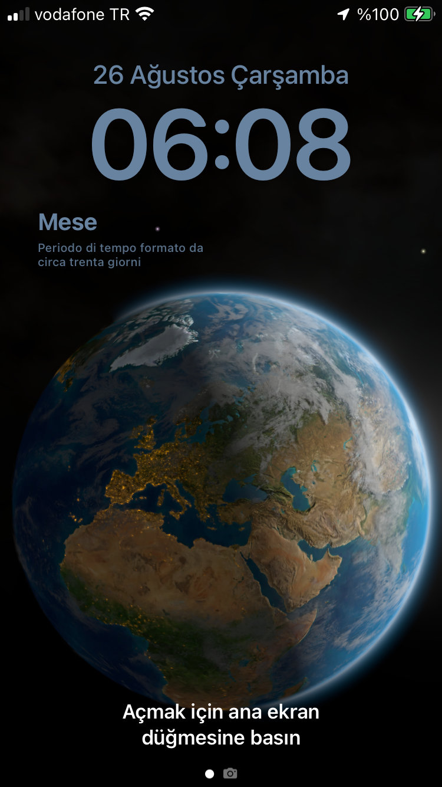
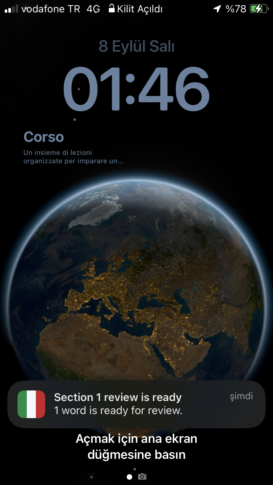
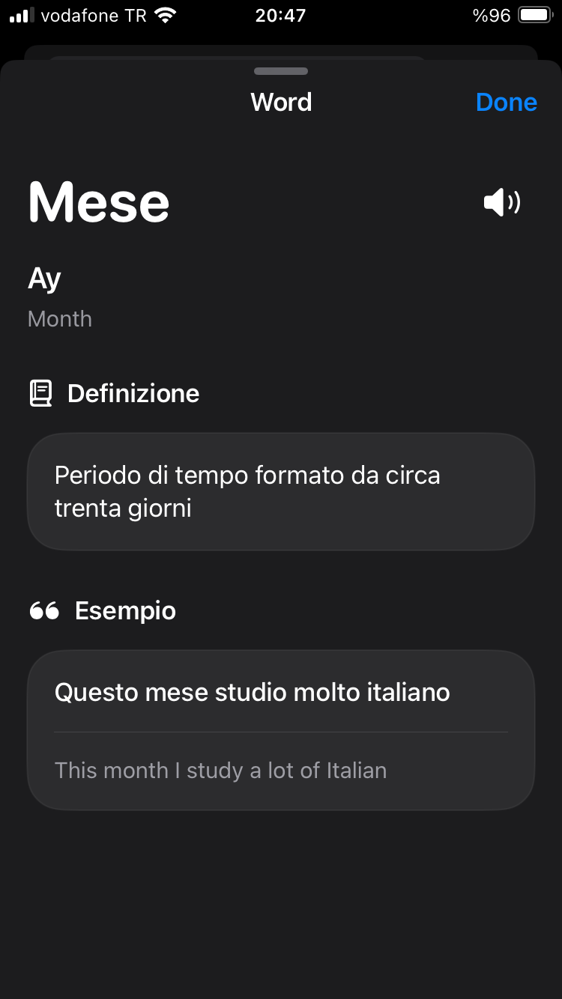
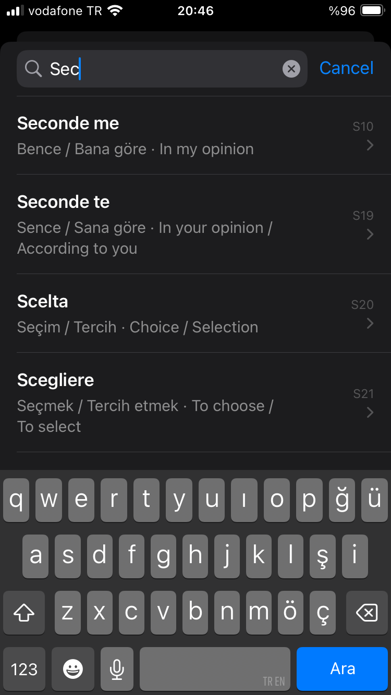
</p>
---

## Vocabulary Quiz

<p align="center">
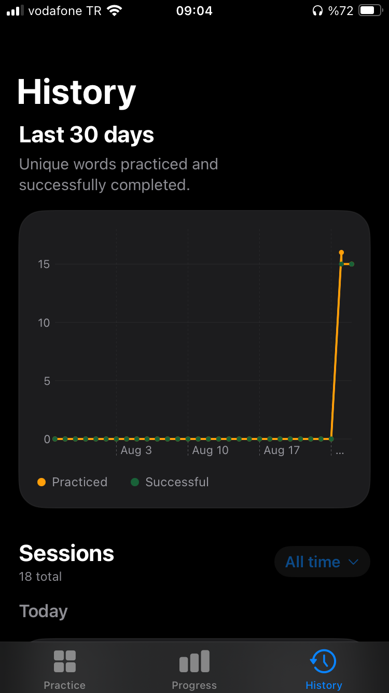
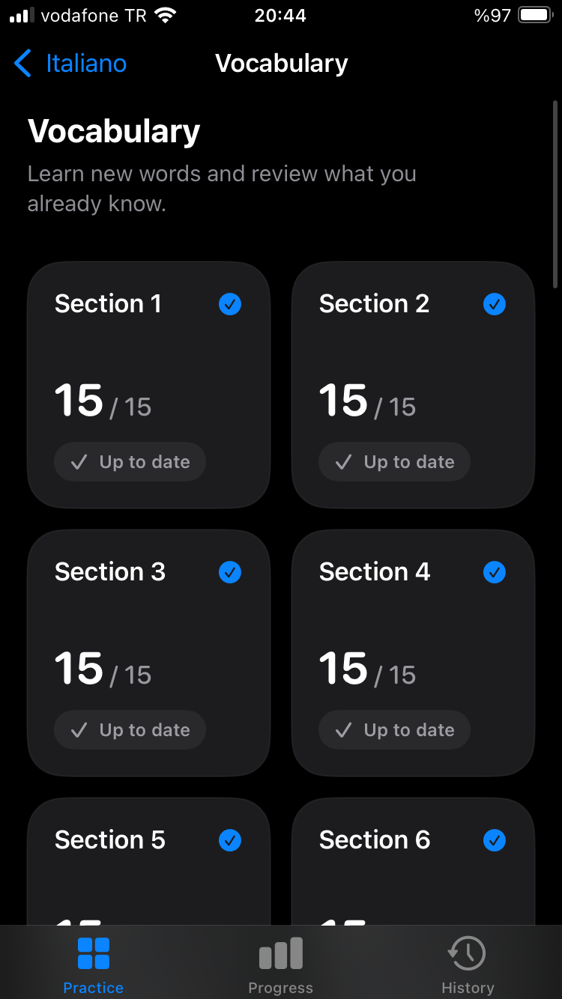
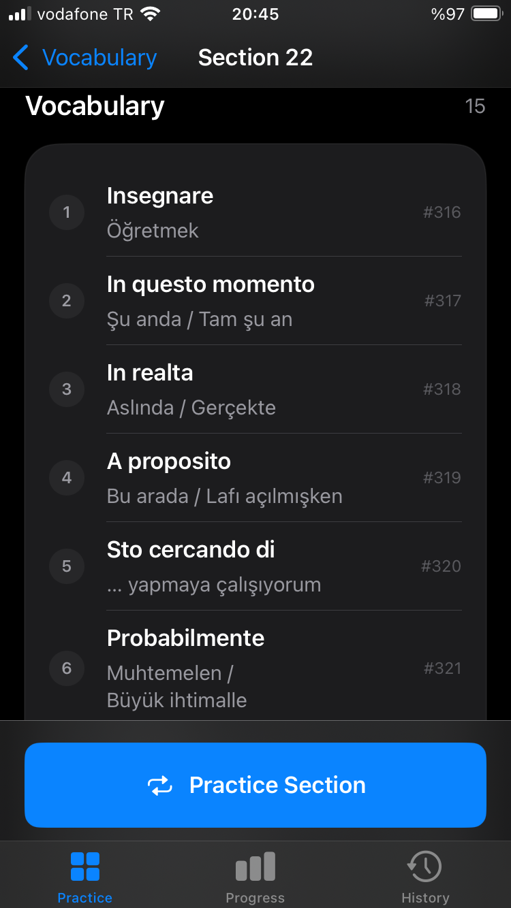
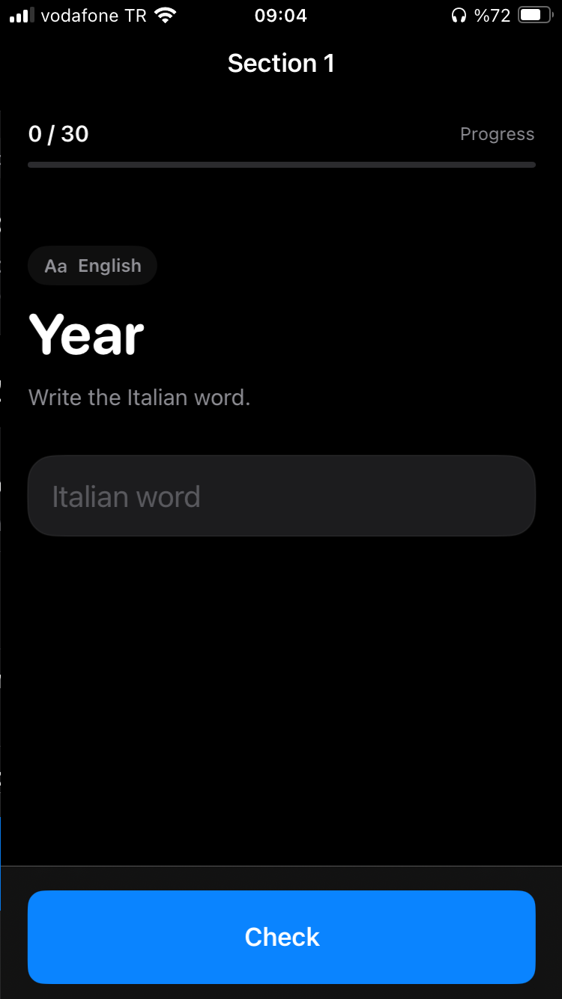
</p>
---

## Conjugation

<p align="center">
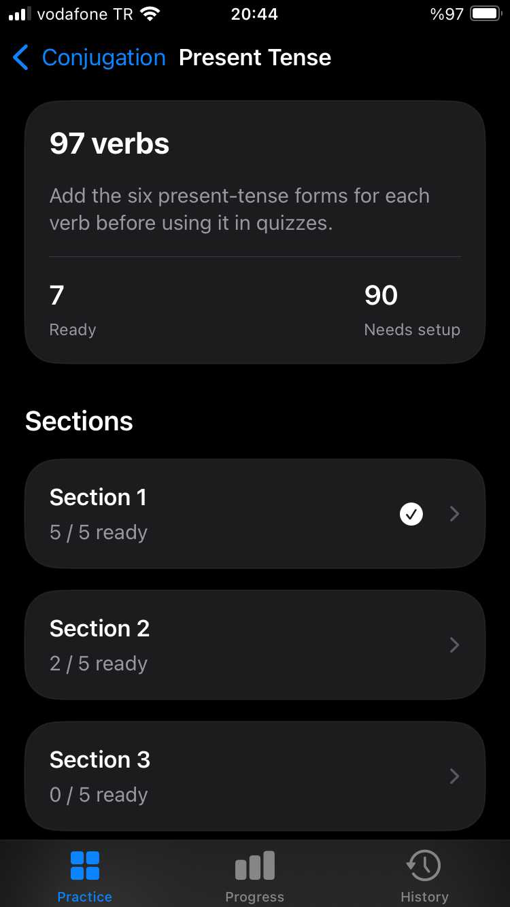
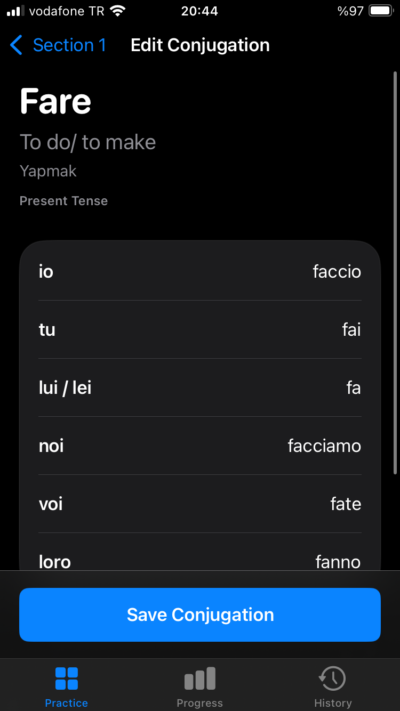
</p>

## History & Progress

<p align="center">
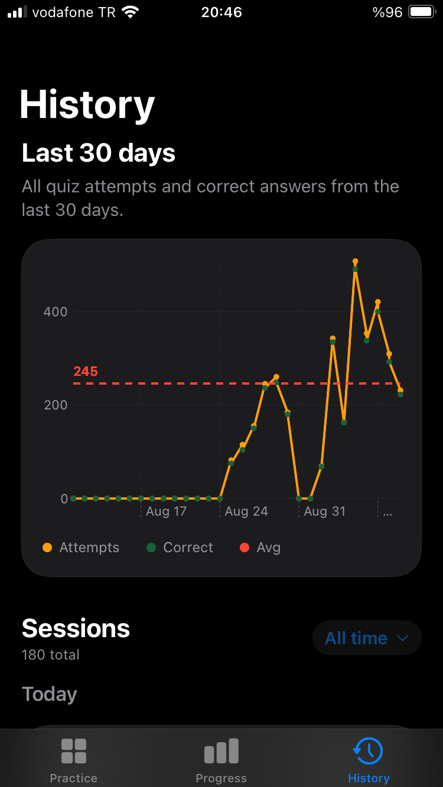
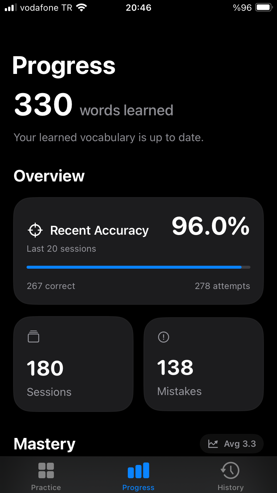
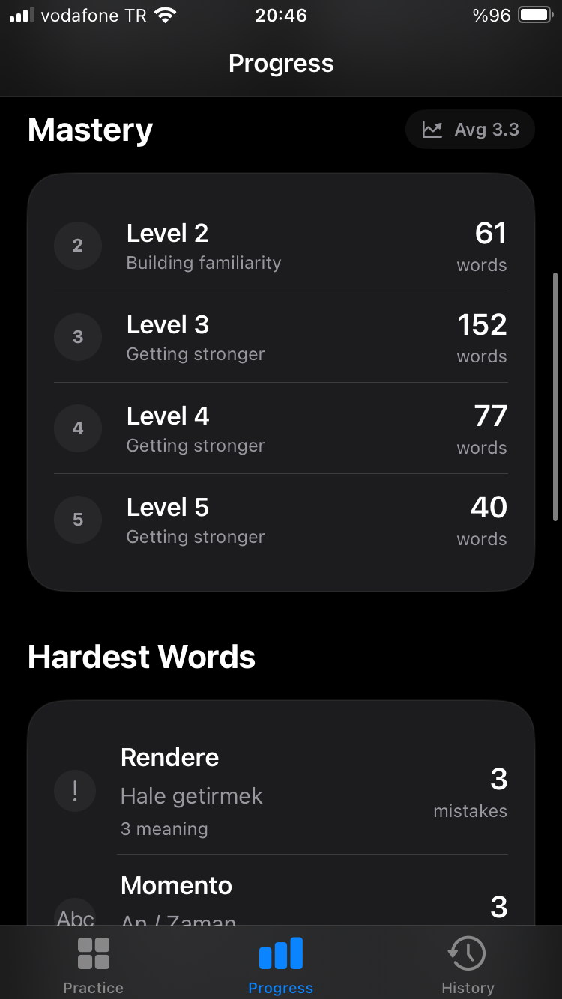
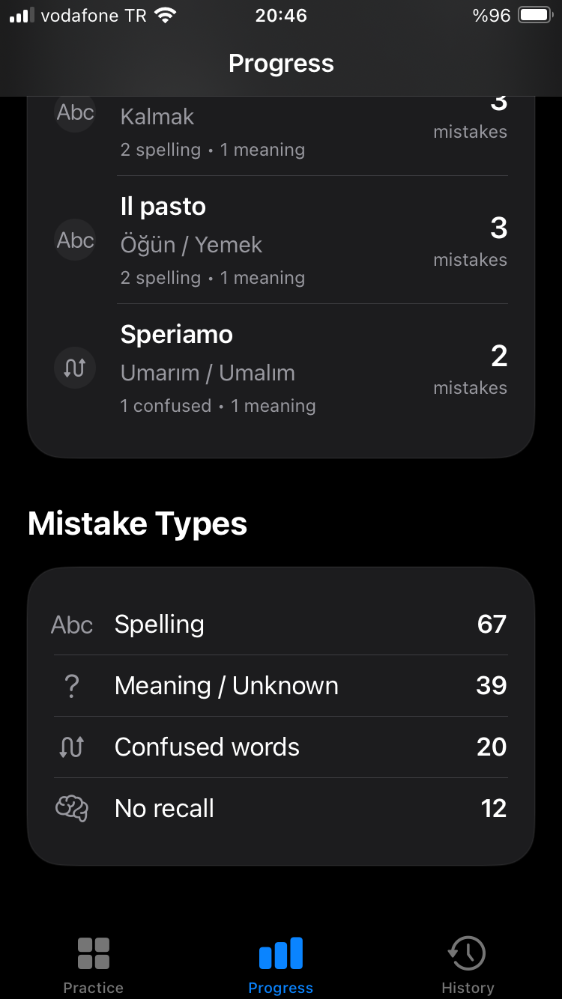
</p>

---

## Vocabulary Sections

Kelime listesi tek seferde gösterilmek yerine **15 kelimelik bölümlere** ayrılıyor.

Her section kendi öğrenme durumunu takip ediyor.

Uygulama:

- yeni kelimeleri section bazında sunar,
- tamamlanan bölümleri takip eder,
- tekrar zamanı gelen kelimeleri belirler,
- section içerisindeki due kelimeleri ayrı gösterir,
- review tamamlandıktan sonra section durumunu otomatik yeniler.

---

## Active Recall Quiz

Vocabulary quizlerinde çoktan seçmeli cevaplar kullanılmıyor.

Kullanıcıya Türkçe veya İngilizce anlam gösteriliyor ve İtalyanca karşılığını klavyeyle doğrudan yazması gerekiyor.

Her kelime quiz içerisinde iki farklı yönden soruluyor:

```text
Turkish → Italian
English → Italian
```

15 kelimelik bir section:

```text
15 words × 2 prompts = 30 questions
```

oluşturuyor.

Sorular shuffle edilerek gösteriliyor.

Yanlış cevaplanan sorular quiz havuzunda kalıyor ve kullanıcı doğru cevabı verene kadar daha sonra tekrar soruluyor.

---

## Spaced Repetition

Vocabulary tarafında her kelimenin ayrı öğrenme durumu bulunuyor.

Bir kelime review sırasında temiz şekilde geçilirse mastery seviyesi artıyor ve sonraki review tarihi ileri taşınıyor.

Örneğin:

```text
Level 1 → 1 gün
Level 2 → 2 gün
Level 3 → 3 gün
Level 4 → 4 gün
...
```

Review sırasında bir kelimede hata yapılırsa kelime tekrar öğrenme havuzuna alınarak kısa sürede yeniden çalışılabiliyor.

Her kelime bağımsız işlendiği için aynı section içerisindeki kelimeler zamanla farklı mastery seviyelerine ulaşabiliyor.

---

## 🔄 Free Practice

Bir section için due kelime bulunmasa bile kullanıcı isterse section'ı tekrar çalışabiliyor.

Free Practice sırasında:

- doğru cevaplar mastery seviyesini artırmaz,
- doğru cevaplar mevcut review tarihini değiştirmez,
- yanlış yapılan kelimeler için mastery level sıfırlanır ve tekrar due hale gelir,
- çalışma session ve attempt geçmişine kaydedilir.

Böylece spaced repetition algoritmasını gereksiz şekilde hızlandırmadan serbest tekrar yapılabilir.

---

# Present Tense Conjugation

Vocabulary sisteminin yanında ayrı bir **Conjugation** çalışma alanı bulunuyor.

---

## Fiillerin Otomatik Belirlenmesi

Kelime veri setindeki İngilizce anlamı:

```text
To ...
```

şeklinde başlayan kelimeler otomatik olarak fiil adayı kabul ediliyor.

Örneğin:

```text
To start / to begin   ✅
To be                 ✅
To have               ✅
To think              ✅

Today                 ❌
Tomorrow              ❌
Together               ❌
Too much               ❌
```

Böylece ayrıca bir fiil listesi tutmak gerekmiyor.

---

## Manuel Conjugation Setup

İtalyanca fiil çekimleri uygulama tarafından otomatik üretilmiyor.

Her fiilin doğru çekimlerini uygulama içerisinden manuel olarak giriyorum.

Bu yaklaşım sayesinde:

- irregular verbs,
- reflexive verbs,
- özel çekimler

yanlış algoritmik tahminlere bağlı kalmadan doğrudan doğru veri üzerinden çalışılabiliyor.

Altı formun tamamı girildiğinde fiil otomatik olarak:

```text
Ready
```

durumuna geçiyor.

Eksik kalan fiiller:

```text
Needs setup
```

olarak gösteriliyor.

---

## 🗄️ Conjugation Veri Modeli

Conjugation verileri Supabase üzerinde ayrı bir tabloda tutuluyor.

```text
verb_conjugations

id
user_id
word_id
tense

io
tu
lui_lei
noi
voi
loro

is_ready
created_at
updated_at
```

Aynı yapı ileride farklı tense türlerinin eklenmesine izin veriyor:

```text
word_id: 42
tense: present_indicative

word_id: 42
tense: future_simple

word_id: 42
tense: passato_prossimo

word_id: 42
tense: imperfect
```

---

# Italian Pronunciation

Kelime detay ekranında iOS'in `AVSpeechSynthesizer` altyapısı kullanılarak İtalyanca telaffuz dinlenebiliyor.

```text
A proposito                         🔊

Bu arada
By the way / Speaking of
```

Uygulama cihaz üzerinde bulunan en kaliteli uygun İtalyanca sesi seçmeye çalışıyor.

Bu sistem:

- internet bağlantısı gerektirmez,
- harici TTS API gerektirmez,
- hızlı cevap verir,
- `it-IT` seslendirme kullanır.

Aynı telaffuz butonu vocabulary quizinde de cevap verildikten sonra görünür.
Böylece cevap kontrolünden hemen sonra kelimenin doğru seslendirmesi dinlenebilir.

---

# Vocabulary Search

Ana ekrandaki arama özelliği ile tüm hazır kelimeler:

- İtalyanca,
- Türkçe,
- İngilizce

alanlarında aranabiliyor.

Bir kelimeye dokunulduğunda doğrudan aynı `Word Detail` ekranı açılıyor.

---

# Word Detail

Kelime detay ekranında:

- İtalyanca kelime,
- Türkçe anlam,
- İngilizce anlam,
- İtalyanca açıklama,
- örnek İtalyanca cümle,
- telaffuz butonu

bulunuyor.

Aynı ekran hem uygulama içindeki search sonuçlarından hem de Lock Screen widget deep link'lerinden kullanılabiliyor.

---

# Review Notifications

Vocabulary spaced repetition sistemi local notification desteğine sahip.

Her section için yaklaşan en erken review tarihi hesaplanıyor ve local notification planlanıyor.

Örneğin:

```text
Section 10 review is ready

3 words are ready for review.
```

Notification'a dokunulduğunda uygulama doğrudan ilgili section ekranına yönlendiriliyor.

---

# History

Quiz geçmişi Supabase üzerinde saklanıyor.

Her quiz session ve her answer attempt ayrı olarak kaydediliyor.

Vocabulary çalışma türleri:

```text
initial_section
section_review
free_practice
```

olarak birbirinden ayrılabiliyor.

Swift Charts kullanılarak son 30 günlük çalışma aktivitesi görselleştiriliyor.

Grafikte günlük olarak:

- attempts,
- correct answers

takip ediliyor.

Aktif günlerin ortalama attempt değeri ayrıca referans çizgisi olarak gösteriliyor.

Uzun vadede büyüyen history verisi için pagination kullanılıyor.

---

# Error Tracking

Yanlış cevaplar yalnızca `wrong` olarak tutulmuyor.

Quiz sistemi hataları farklı kategorilere ayırabiliyor.

Örneğin:

```text
spelling_error
confused_with_another_word
wrong_word_form
no_recall
unknown_or_semantic_error
```

Bu veriler daha sonra `Hardest Words` ve hata analizi ekranlarında kullanılabiliyor.

---

# Lock Screen Widget

WidgetKit kullanılarak geliştirilen Lock Screen widget, gün boyunca İtalyanca kelimelerle karşılaşmaya devam etmeyi sağlıyor.

Widget:

- İtalyanca kelimeyi,
- kelimenin İtalyanca açıklamasını

kilit ekranında gösteriyor.

Kelime her uygulama açılışında değişmek yerine yaklaşık **3 saatlik bir timeline rotation** kullanıyor.

Ana uygulama uygun kelimeleri hazırlıyor ve **App Group** üzerinden widget ile paylaşıyor.

Widget öncelikle due kelimeleri, ardından öğrenilmiş kelimeleri ve gerektiğinde hazır vocabulary listesini kullanabiliyor.


---

# Python Projesiyle Bağlantısı

Yeni kelimeleri CSV'ye ekledikten sonra:

```bash
python sync_words.py
```

komutuyla yalnızca yeni kelimeler Supabase'e aktarılıyor.

CSV halen vocabulary için **source of truth** olarak kullanılmaya devam ediyor.

```text
Italyanca_Kelimeler.csv
        ↓
/python sync_words.py
        ↓
      Supabase
        ↓
    Mobil Uygulama
```

Böylece mevcut CSV tabanlı çalışma düzenimi değiştirmeden Python ve iOS projelerini aynı öğrenme sistemi içerisinde kullanabiliyorum.

---

# Teknik Yapı

Uygulama ağırlıklı olarak native Apple teknolojileri kullanılarak geliştiriliyor.

```text
Swift
SwiftUI
Swift Concurrency
Supabase Swift
Supabase Auth
PostgreSQL
RLS
Swift Charts
WidgetKit
App Groups
UserNotifications
AVFoundation
AVSpeechSynthesizer
```


---

## Related Project

Python tabanlı kelime quiz ve analiz sistemi:

**Italian Vocabulary Quiz & Learning Analyzer**

https://github.com/MelihSiskular/italyanca-kelime-tekrar-ve-analiz

---

## Author

**Melih Şişkular**
